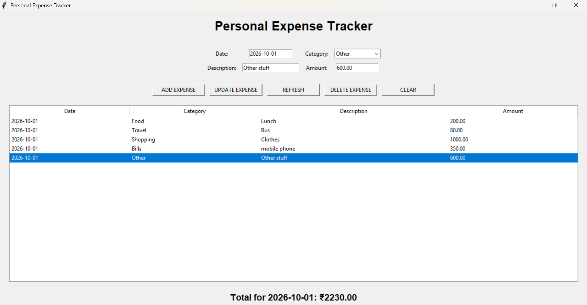
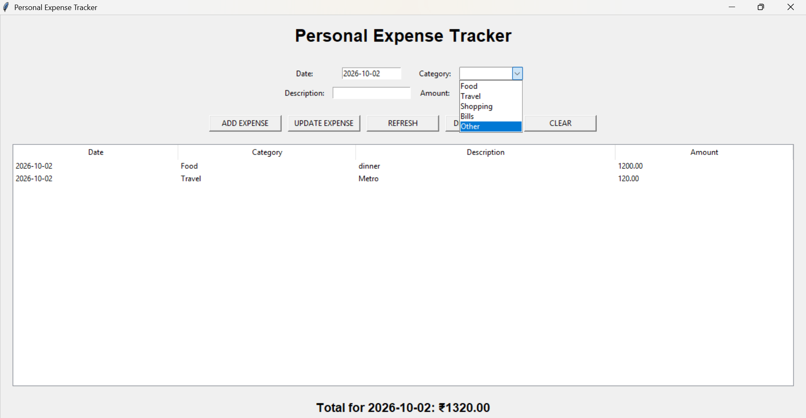

# Personal Expense Tracker

A simple **Personal Expense Tracker** built using **Python, MySQL, and Tkinter**.

The application allows users to add, view, update, and delete expenses. Expenses can be filtered by date, and the application automatically calculates the total expenses for the selected date.

## Features
* Add new expenses
* View expenses by selected date
* Update existing expenses
* Delete expenses
* Calculate daily expense total
* Category selection
* Simple Tkinter graphical user interface
* MySQL database integration
* Separate database and UI logic

## Technologies Used
* Python
* Tkinter
* MySQL
* mysql-connector-python
* SQL

## Project Structure

```text
Personal-Expense-Tracker/
│
├── app.py
├── database.py
├── .gitignore
└── README.md
```

## Database Structure
The project uses a MySQL database named `expense_tracker`.

### Expenses Table

| Column       | Data Type     | Description         |
| ------------ | ------------- | ------------------- |
| id           | INT           | Unique expense ID   |
| expense_date | DATE          | Date of expense     |
| category     | VARCHAR(50)   | Expense category    |
| description  | VARCHAR(255)  | Expense description |
| amount       | DECIMAL(10,2) | Expense amount      |

## How It Works
1. The user enters an expense date.
2. The user selects a category.
3. The user enters a description and amount.
4. The expense is stored in MySQL.
5. Expenses for the selected date are displayed in the Tkinter table.
6. The application calculates and displays the total expense for that date.

## Installation

### 1. Clone the repository

```bash
git clone https://github.com/YOUR-USERNAME/SQL-Tkinter-Expense-Tracker.git
```

### 2. Navigate to the project folder

```bash
cd SQL-Tkinter-Expense-Tracker
```

### 3. Install the required package

```bash
pip install mysql-connector-python
```

### 4. Create the MySQL database

Open MySQL and run:

```sql
CREATE DATABASE expense_tracker;

USE expense_tracker;

CREATE TABLE expenses (
    id INT AUTO_INCREMENT PRIMARY KEY,
    expense_date DATE NOT NULL,
    category VARCHAR(50) NOT NULL,
    description VARCHAR(255),
    amount DECIMAL(10,2) NOT NULL
);
```

### 5. Configure the database connection

Open `database.py` and update your MySQL connection details:

```python
connection = mysql.connector.connect(
    host="localhost",
    user="YOUR_USERNAME",
    password="YOUR_PASSWORD",
    database="expense_tracker"
)
```

Replace `YOUR_PASSWORD` with your local MySQL password.


### 6. Run the application

```bash
python app.py
```

## Example

For example, the application can store:

| Date       | Category | Description | Amount |
| ---------- | -------- | ----------- | -----: |
| 2026-10-01 | Food     | Lunch       |   ₹150 |
| 2026-10-01 | Travel   | Bus         |    ₹80 |
| 2026-10-01 | Shopping | Clothes     |  ₹1200 |

The application displays the transactions for the selected date and calculates the daily total.

## Application Screenshot
Here is a screenshot of the Personal Expense Tracker application:




## Learning Outcomes

Through this project, I practiced:
* Python programming
* SQL queries
* MySQL database integration with Python
* Tkinter GUI development
* CRUD operations
* Parameterized SQL queries
* Database connection handling
* Separating database logic from application logic

## Future Improvements

* Monthly expense reports
* Expense charts
* Export expenses to Excel/CSV
* User login system
* Budget tracking
* Search and filtering options

This project was created as a practical project to strengthen Python, SQL, MySQL, and Tkinter skills.
